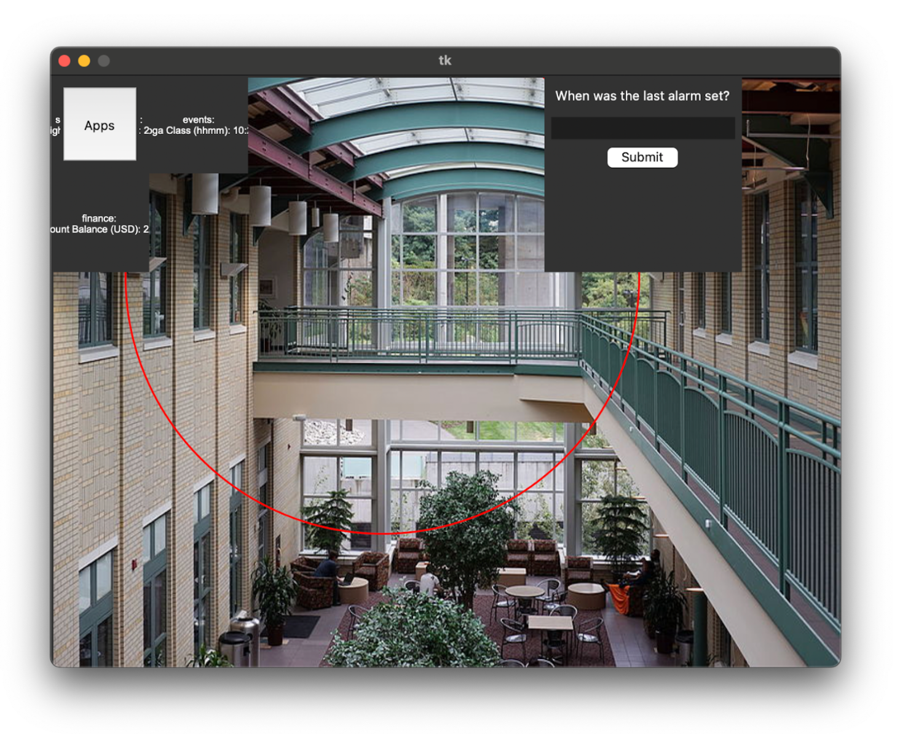

# P1: UI optimization

Since you probaly forked this repository, you have to merge the new code from upstream. 

## Setup
You will be building on the starter code provided. To run this code, setup an environment with all dependencies 
installed. 

Create a new conda environment using Python 3.11.11. In the Anaconda prompt, run:
```
conda create -n cmis_P1 python=3.11.11
```

Activate the environment:
```
conda activate cmis_P1
```

The dependencies for this project are listed in the `requirements.txt` file. To install them, navigate (`cd`) into the 
folder where `requirements.txt` is located and execute:
```
pip install -r requirements.txt
```

This will install numpy, gurobipy, and PIL if you don't have the libraries installed already.

Make sure that your project is using the correct Python interpreter. In PyCharm, you can set the Python interpreter 
by going to `File > Settings > Project:[NAME] > Python Interpreter`. Select the `cmis_P1` environment as your 
Python interpreter.

If your development environment is set up correctly, you should be able to run `main.py`, which will open a window as follows: 




## Code structure

- `main.py` is the file that _you will be working in_. You should implement the optimization algorithm in this file. You can pass your optimized applications to the UI, which knows how to display them and implements the interaction.
- `app.py` handles the _content_ for the UI elements. It reads the contents of the application elements and creates the data by randomizing the content between the given bounds. You should not need to modify this file.
- `ui.py` contains the code for the user interface. You should not need to modify this file, but you may make adjustments to the visuals within the rules.
  - `class UI` manages the entire UI. It creates the grid, initializes the UI elements of type `MainAppUI`, the "All Apps" button and window `ListAppUI`, and the question panel. 
  - `class MainAppUI` are the UI elements that you were optimizing and pass to the UI. This class displays them and updates the content when users click them accordingly.
  - `class ListAppUI` is the panel listing all applications that are not currently displayed. Users can click the "Apps" button to retrieve information from applications that are not displayed.
  - `class UILogger` logs the results of the user's questoins and the summary of the entire run. It writes the results on the console and in a .csv file.
- `example.py` allows you to hard-code UI placment for debugging purposes. It is not called by any other classes.

**Your main task is to optimize the visibility, placement, and level of detail for your UI.** `main.py` currently contains a random term as objective. You need to replace this with your objective functions and constraints. 
Clearly, the random term is a terrible objective as it does not account for overlaps of the elements with other elements, the "Apps" button or the questions panel. It is only here show a simple example of how to set up the model and run the optimization.

### Data structure
The `scene` folder contains the data that is rendered. 
- `scene-N.json` defines the questions, path to the applications and the relevance.
- `apps/apps-N.json` defines the contents for the applications that you will optimize.

## Details

You can find more details about the starter code here:
https://docs.google.com/document/d/1ihqBvWkyIqNXpPf0TdAXVy2K0BfwB1y8AK7Q6iIPdBg/edit?usp=sharing